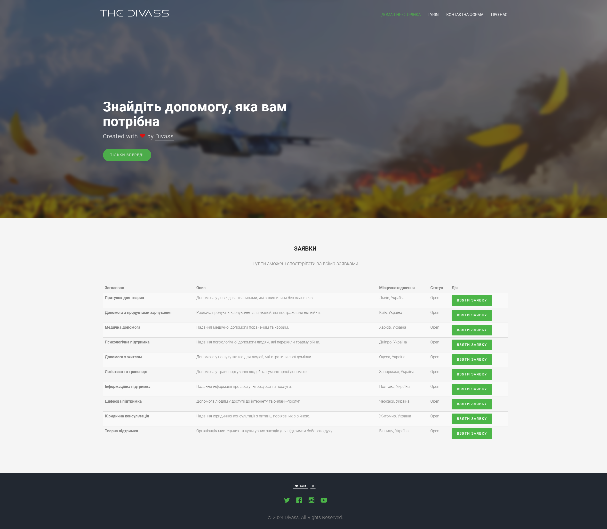
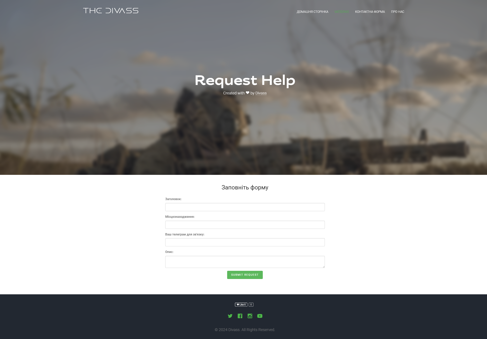
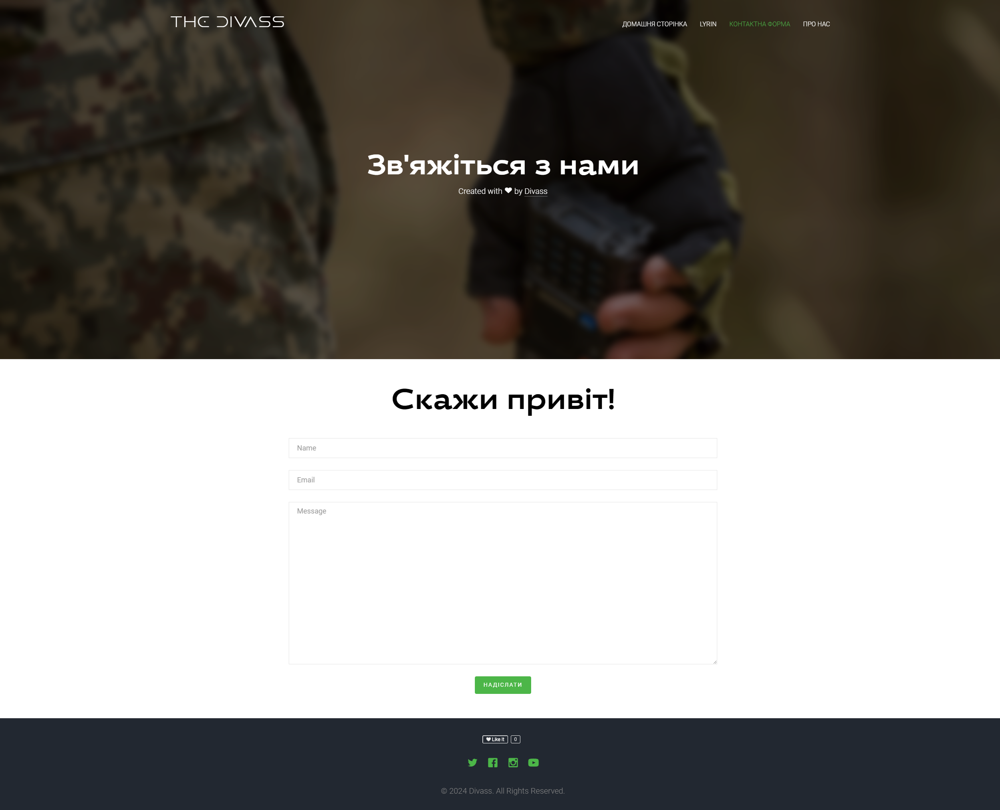
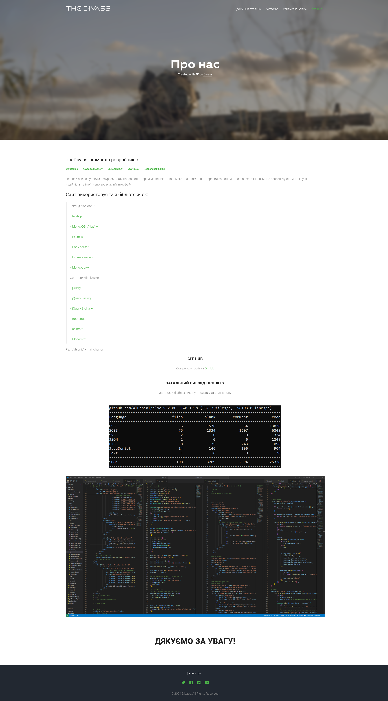

<h1 align="center">
    <b>Divass-Help<br> Node.js with MongoDB </b> 
<br>
</h1>


<p align="center">
  <a href="/License"></a>
</p>


## Table of contents

* [Description](#description)
* [Getting Started](#getting-started)
* [Installation](#install)
* [Authors](#authors)


## Description

This website is a great resource that gives volunteers the opportunity to help people. It is built using various technologies that ensure its flexibility, reliability and intuitive interface.

### Deployment
This Project is **[Live]()** on: ****

### Docker
Repo on ***[docker](https://hub.docker.com/repository/docker/w1nsou/divass-help/general)***

## Getting Started

### •Main Form:



### •Registration Form:
Allows the user to register their account by filling their Email, Username, Password, telegram(for contact), role.


### •Login Form:
If the user has been registered on the app, where you can login.


### •User's Profile:
After the user logged in, a simple profile with the user's username password and role<br>displayed with a session Logout button.


### •Request-help Form:




### •Contact Form:



### •About Form:



### DataBase:
MongoDB **[MongoDB Atlas(Cloud)](https://www.mongodb.com/cloud/atlas)** serves as our database. Three collections reside within this database:
- "sessions"
- "users"
- "volonteerhelps"

## Prerequisites
Tools required to successfully execute this application:

- ***Node.js: [https://nodejs.org/en/](https://nodejs.org/en/)***
- ***Node Package Manager: [https://www.npmjs.com/get-npm](https://www.npmjs.com/get-npm)***
- ***MongoDB (Atlas): [https://www.mongodb.com/cloud/atlas](https://www.mongodb.com/cloud/atlas)***

# Install 
```
npm install
```

**## Database Connection**
Modify line 12 within `./server.js`:
* Replace ***`<DB_USERNAME>`***  with your MongoDB Atlas username.
* Replace ***`<DB_PASSWORD>`*** with your MongoDB Atlas password.

**## Application Execution**
```
node server.js
```

The server will start Running on
+ http://localhost:3000/

## Help

If you are unable to install the libraries at the first attempt, try deleting the “node_modules” folder and the “package-lock.json” file.

After that, enter the command:
```
npm install

npm i
```

## Authors

ex. [@Vatsonio](https://t.me/vatsonio)
ex. [@AdamSmasherr](https://t.me/IllaIlev)
ex. [@Dronchik09](https://t.me/andriy_chornobai)
ex. [@W1nSoU](https://t.me/W1nSoU)
ex. [@bushchakkkkkky](https://t.me/bushchakk)

## Version History
* 0.5
    * fix bugs
    * Add Hash pass using 'bcrypt'
    * Readme.md edited
* 0.4
    * fix bugs
    * Edited ForgetPass page
    * Readme.md edited
* 0.3
    * Added good code
    * Readme.md edited
* 0.2
    * Added Start code
    * See [commit change]() or See [release history]()
* 0.1
    * Initial Release
